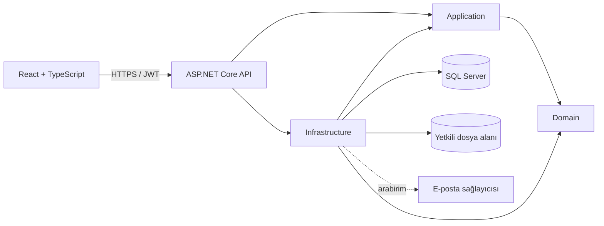
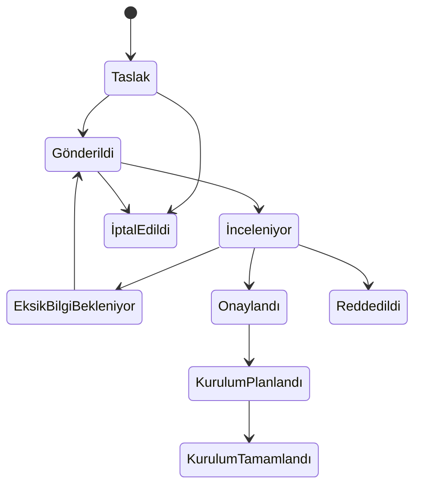

# Mimari

FBU Laboratuvar Yazılım Talep Sistemi, istemci ile veri erişimi arasındaki bağımlılıkları sınırlayan dört backend katmanı ve bağımsız bir React istemcisi olarak tasarlanmıştır.

## Katman sorumlulukları

- `FbuLabSoftware.Domain`: Entity, enum, durum geçişleri ve saf domain kuralları.
- `FbuLabSoftware.Application`: DTO, doğrulayıcı, use-case servis sözleşmeleri, sayfalama ve yetkilendirme bağlamları.
- `FbuLabSoftware.Infrastructure`: Entity Framework Core, Identity, JWT/refresh token, seed, audit, dosya ve rapor uygulamaları.
- `FbuLabSoftware.Api`: Controller, kimlik doğrulama politikaları, middleware, OpenAPI, rate limit ve health check.
- `frontend`: React Router, TanStack Query, form doğrulaması ve rol bazlı kullanıcı deneyimi.

Controller katmanı veri sorgulamaz ve iş kuralı çalıştırmaz; yalnızca HTTP modellerini use-case servislerine aktarır.

## Yetkilendirme sınırı

Her veri okuma, güncelleme, dosya indirme ve rapor sorgusu sunucu tarafında aynı kapsam filtresinden geçer:

| Rol | Talep kapsamı | Fakülte kaynağı |
| --- | --- | --- |
| Academic | Yalnız JWT `sub` sahibi olduğu talepler | Kullanıcı profilindeki fakülte |
| FacultyAuthorizedUser | `UserFacultyPermissions` içindeki izinli fakülteler | İzin kaydı |
| SystemAdministrator | Tüm aktif kayıtlar | İstek veya yönetim işlemi |

İstemciden gönderilen `UserId` ve akademisyen için gönderilen `FacultyId` güven kaynağı değildir. Kapsam dışı mevcut kayıtta `403`, bulunmayan kayıtta `404`, kimliksiz istekte `401` döndürülür.

## Talep yaşam döngüsü

Ret ve eksik bilgi geçişlerinde açıklama zorunludur. Kurulum tamamlamada personel, tarih, sürüm, laboratuvarlar ve kurulum notu saklanır. Durum değişiklikleri audit ve uygulama içi bildirim üretir.

## Veri modeli ilkeleri

- Kimlik verileri ASP.NET Core Identity tablolarında tutulur.
- İş tabloları UTC audit alanları ve gerektiğinde soft-delete filtresi taşır.
- Çoklu program, eklenti, ders oturumu, laboratuvar ve öğrenci listesi ayrı ilişki tablolarıdır.
- Aynı talepte öğrenci numarası bileşik benzersiz indeksle korunur.
- Refresh token yalnız hashlenmiş değeriyle saklanır; rotation sırasında eski token iptal edilir.
- Kullanıcı/fakülte/program/laboratuvar seed verileri yalnız `Development` ortamında oluşturulur.

## Genişletme noktaları

- `IEmailSender`: Development ortamında log-safe/no-op sağlayıcı; üretimde SMTP veya kurumsal sağlayıcı.
- Kimlik sağlayıcı: Identity kullanıcı modeli korunarak Active Directory veya Microsoft Entra ID doğrulaması eklenebilir.
- `IFileStorage`: Yerel korumalı klasör yerine kurumsal dosya servisi/nesne depolama.
- Akademik dönem uzatmaları: Kullanıcı veya fakülte hedefli ek süre kayıtları.
- Raporlama: Aynı sunucu taraflı kapsam filtresini kullanan ek Excel/CSV/PDF rapor tanımları.

